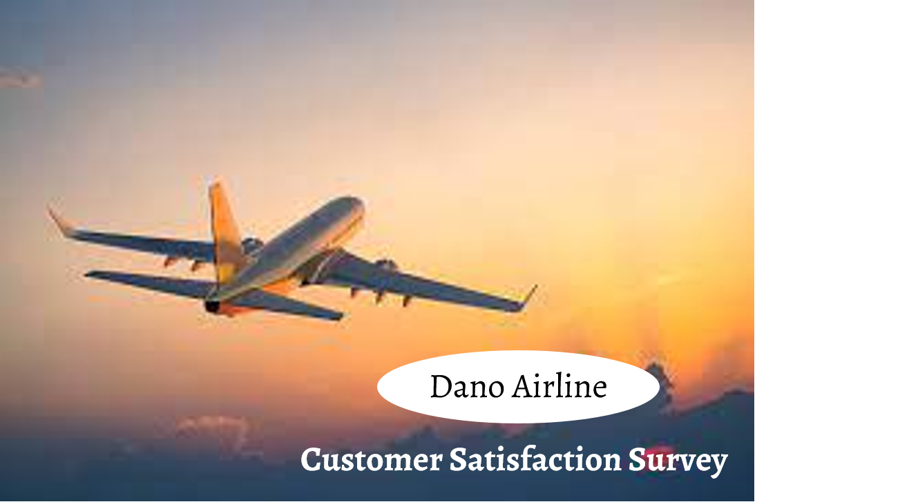
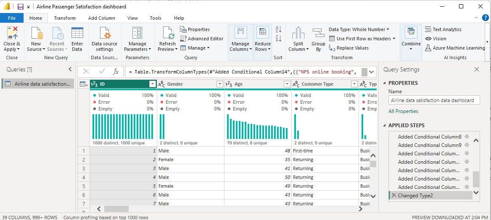
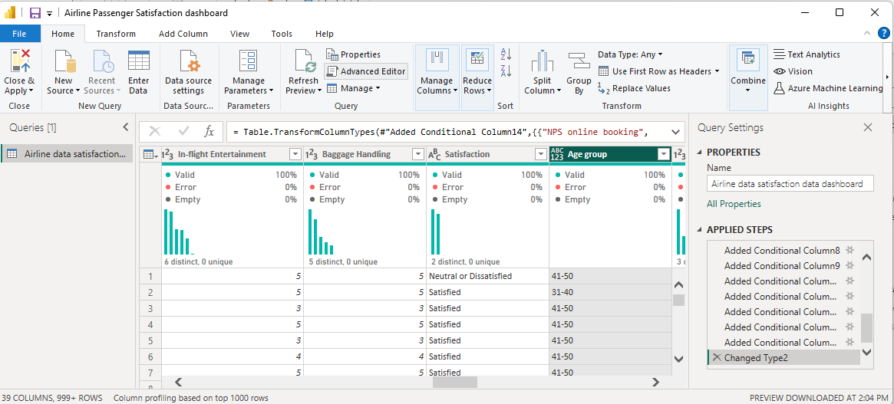
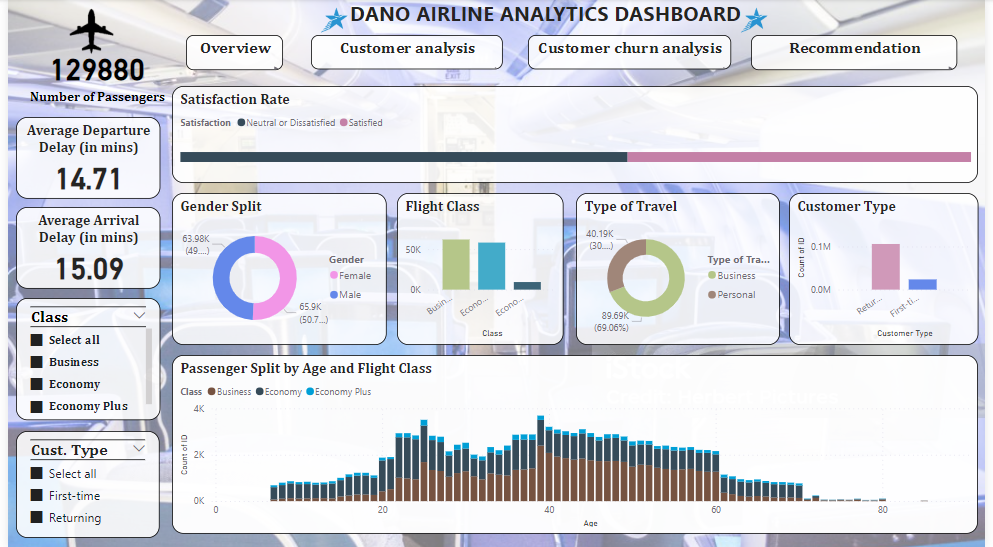
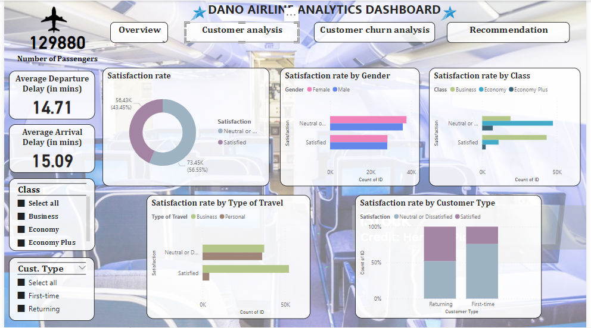
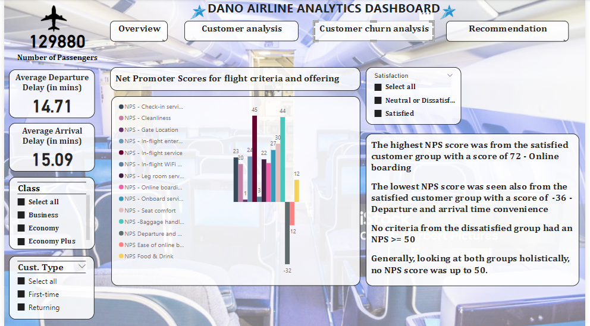
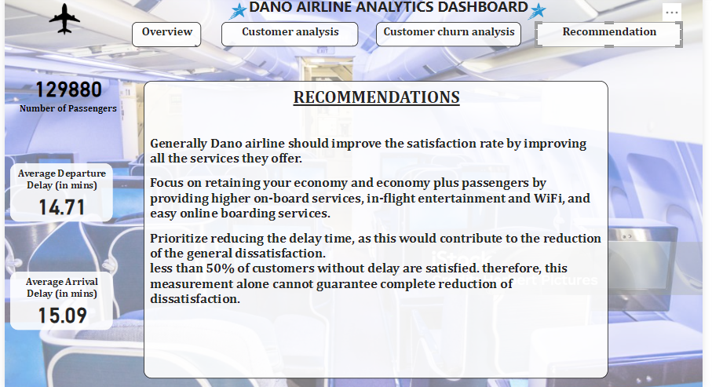

# Dano Airline Customer Satisfactory-Survey Report by Ijeoma Nwosu

---
## Introduction
The aim of this project is to exhibit my problem solving, data cleaning, analyzing and visualizing skills with **Dano airline** data using Power BI
The Data for Dano airlines, provides measures that speaks to general and overall experience for over 120,000 passengers including their satisfaction scores.
The purpose of this report is to present an overview of the data analysis project conducted using Dano Airline data. 
This project aimed to analyze various aspects of airline operations, understand customer satisfaction level, to identify trends, patterns, and insights that could optimize performance and enhance customer satisfaction.
**The Report consists of four pages imbedded in 4 buttons on the dashboard**
1.	Overview
2.	Customer analysis
3.	Customer churn analysis
4.	Recommendation

## Problem Statement
Recommend a data-driven strategy for increasing Dano Airlines’ satisfaction rate and present it in the form of a single report or dashboard. 
Data Sourcing
The Dataset was provided by digitaleydrive
Link to Dataset https://docs.google.com/spreadsheets/d/15Kp-2yfQFNRGJPNOkpMwG-OMX8xVZOJ5VL7f35v7sR 

Details about the data source
1.	FULL DATA with 129,881 rows and 24 columns.
   
## Skills Demonstrated
**Data Transformation/Cleaning**
Data was efficiently cleaned and transformed with the Power Query Editor of Power BI.

---
Some of the applied steps included
**DAX Concepts**:
--
a.	**Conditional column** was used to create a new column ‘Age range’ ages of all the passengers were grouped into 10groups.
0-10, 11-20, 21-30, 31-40, 41-50, 51-60, 61-70, 71-80 and 81-90

---

b.	**Net Promoter Score (NPS)** was also calculated using DAX, by;
-	Creating a ‘Conditional column’ where scores were attributed to each satisfaction level 
-	5 and 4 = 100 (Promoter)
-	3 = 0 (Passives)
-	2 and 1 = -100 (Detractors)
NPS = Promoters – Detractors x 100 and the average score per criteria was calculated by using ‘Measures’ function in DAX.

---

c.	**Measures in DAX** was also used to calculate the total number of passengers of Dano airlines.

d.	**Analytical transformation** of the measures was also done to understand the average departure delay and average arrival delay

## Data Modelling
Data modelling wasn’t used for the report as all the data required was available on one sheet

## Analysis and Visualization
**Visualization**
The Report consists of four pages imbedded in 4 buttons on the dashboard
1.	Overview
2.	Customer analysis
3.	Customer churn analysis
4.	Recommendation
   
**Overview**
Using power BI, a comprehensive dashboard broken down into the overview sheet, customer analysis sheet, customer churn analysis sheet and recommendation sheet to show in details;

**Overview sheet** – speaks to the demographics of the customers, the customer type, type and travel and flight.

---

**Customer analysis sheet** – speaks to the satisfaction by different groups of customers.

---

**Customer churn analysis sheet** – speaks to the Net Promoter Score for all the airline offerings by customer type and class.

---

 Utilizing stacked pie charts, clustered column charts, stacked column charts and 100% stacked bar chart, for effective comparisons and trend, slicers and visual cards were also included to better functionality and better dashboard interaction
These components collectively form an interactive and intuitive report, fostering enhanced comprehension and examination of the survey results. Thoughtful attention to accurate labeling, color choices, and relevant annotations ensures that the visuals are easily comprehensible for the audience.

## Insights
From passengers surveyed, 
- 47.9% of the total number of passengers (129,880) flew business class
- 44.9% flew economy and
- 7.2% flew economy plus.
  
**Out of this the satisfaction rate recorded was as follows**
- Business– 69.4% (43,166)
- Economy – 18.8% (10,943) and
- Economy plus – 24.6% (2,319)
From this we deduce that a higher proportion of the satisfied passengers belonged to the business class, while the majority of those expressing neutral or dissatisfied opinions were in the economy class.
**In terms of customer loyalty**, out of 129,880 passengers, 81.7% (106,100) were returning customers and 18.3% (23,780) were first time customers. The satisfaction rate recorded for this group was 47.81% for returning customers and 23.97% for first time customers.
  
**NPS (Net Promoter Score)**
- The highest NPS score was from the satisfied customer group with a score of 72 - Online boarding
- The lowest NPS score was seen also from the satisfied customer group with a score of -36 - Departure and arrival time convenience
- No criteria from the dissatisfied group had an NPS >= 50

Generally, looking at both groups holistically, 
no NPS score was up to 50.

**NPS analysis**
Business class had 4 metrics with NPS score above 50% (inflight service, online boarding, seat comfort, baggage handling) and 2 metrics with negative NPS score (departure and arrival time convenience, and ease of booking)
Economy and economy plus both had 4 metrics with negative metric score (online boarding, departure and arrival time convenience, and ease of online booking) 
A majority of passengers, comprising 66.32%, who categorized their travel type as business, opt for the business class. Among them, 28.21% choose economy, and 5.71% prefer economy plus. For those traveling for personal reasons, 6.65% choose economy, 82.13% prefer economy class, and 11.22% opt for economy plus.

## Recommendation
. Generally Dano airline should improve the satisfaction rate by improving all the services they offer.

. Focus on retaining your economy and economy plus passengers by providing higher on-board services, departure and arrival time convenience, in-flight entertainment and WiFi, and easy online boarding services.

. Prioritize reducing the delay time, as this would contribute to the reduction of the general dissatisfaction.
less than 50% of customers without delay are satisfied. therefore, this measurement alone cannot guarantee complete reduction of dissatisfaction.

